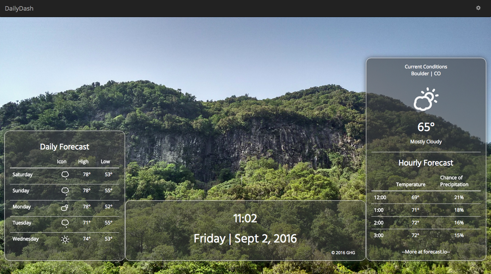
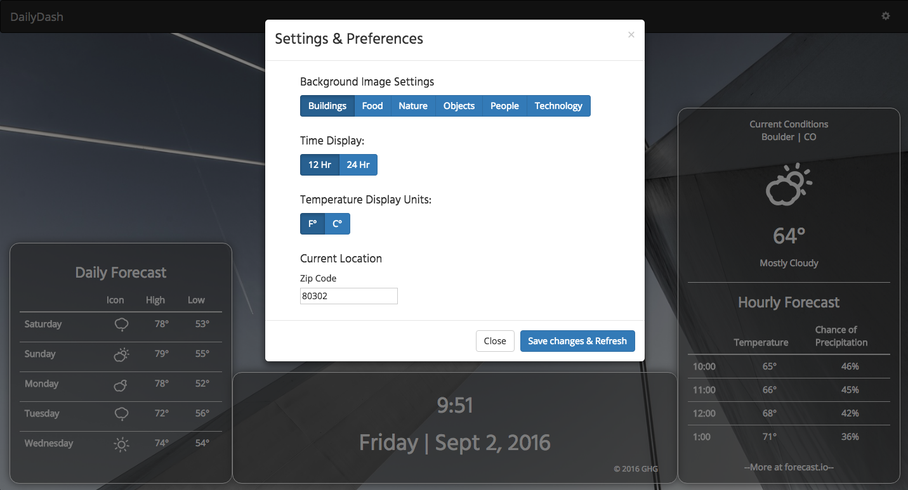

#DailyDash
A customizable landing page providing the user with date, time, current weather, and forecast set atop a beautiful background image. The DailyDash will be helpful for users with access to a personal computer.

DailyDash was built with HTML, CSS & Bootstrap, JavaScript & jQuery, and web APIs.

##Display

Main display of DailyDash with daily forecast, current time and date, hourly forecast, and current conditions.

Settings and preferences page with options for background image category, time display, temperature display, and current location.

##Special Thanks
* [Forecast.io](http://forecast.io) for the up to date weather information
* [Unsplash](http://unsplash.com) for the beautiful photography integration.
* [Surge](http://surge.sh) for fast and easy deployment.
* [Pivotal](https://www.pivotaltracker.com/n/projects/1790215) for the easy tracking of progress and features.
